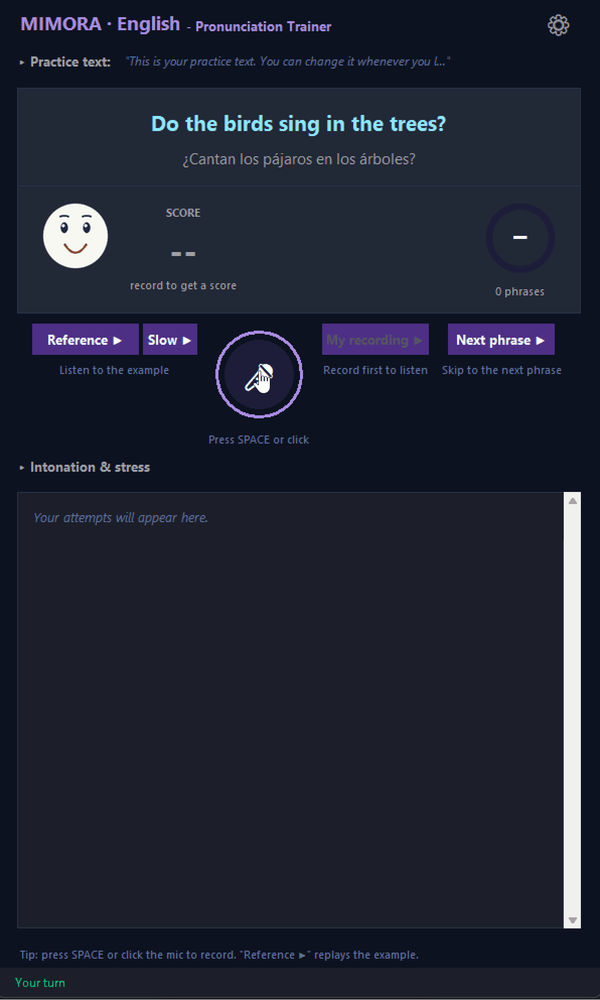

# Mimora

**A local, offline pronunciation trainer.** Mimora says a phrase out loud, you repeat it, and it scores how close you were - highlighting the words to work on. Practice the same phrase until you pass, then move on to the next one. Everything runs on your machine: speech synthesis, speech recognition, phrase generation, and acoustic analysis.

<p align="center">
  
</p>

| Dark theme | Light theme |
|:---:|:---:|
|  |  |

*Themes are configurable in `config/themes/`.*

---

## Why Mimora?

- 🔒 **100% offline after install** - your voice never leaves your computer. No cloud, no accounts, no API keys.
- ♾️ **Unlimited, varied practice** - a local LLM writes fresh phrases from your own text, so you are not stuck repeating the same canned sentences.
- 💸 **No subscription** - free and open source; the only cost is disk space for the models.
- 💻 **Runs on a normal PC** - works on **16 GB RAM with no graphics card**. A GPU is optional and just makes it faster.
- 🎯 **Instant, word-level feedback** - a 0-100 score plus the exact words to work on, with reference-vs-you replay.

## Who is it for?

Anyone working on clearer speech in a new language - language learners, accent reduction, and shadowing practice. You bring your own text (a paragraph, a song, a script) and Mimora turns it into spoken drills and scores how close you get.

## Supported languages

The practice language is chosen in the settings window (**Language**, applies after a restart); each language may offer regional variants (**Accent**).

| Language | Variants | Scoring engines |
|---|---|---|
| **English** | American, British | `phoneme` (default, calibrated), `acoustic`, `none` |
| **Spanish** (Peninsular / Castilian) | Castilian | `phoneme` (**experimental** - no Spanish calibration yet, scoring falls back to the English calibration until it lands), `none` |

Mimora is built for practicing **English** (American and British, fully calibrated). Under the hood the scoring engine is language-independent, and multilingual support is in development. **Spanish** is included as an experiment: until a Spanish calibration lands, scoring falls back to the English calibration (usable, not tuned); a proper calibration requires labeled non-native speech data for that language.

The English-only `acoustic` engine is not offered for Spanish. (The translation panel already renders the practice phrase in 200+ languages - that is the translation shown beside the phrase, not the practice language itself.)

---

## How it works

For each practice phrase Mimora runs a simple loop:

1. **Prompt** - a phrase is generated by the local LLM from your *practice text*, then spoken aloud by the active language's TTS voice (Kokoro for English, Supertonic for Spanish; this synthesized audio is also the reference for scoring).
2. **Record** - you press `SPACE` (or click the mic) and repeat the phrase; the take stops on its own once you fall silent (or press `SPACE` / click the mic again).
3. **Analyze** - your recording and the reference are compared in a background thread by the active pronunciation engine - by default the **phoneme** engine (espeak reference phonemes vs a wav2vec2 phoneme recognizer) - plus prosody (pitch / energy). An alternative **acoustic** engine (Wav2Vec2 embeddings + DTW) is selectable in the settings window (**Engine**; settings.json `"engine"`).
4. **Feedback** - you get a score out of 100, what was recognized, and the words to improve.
5. **Loop** - repeat the same phrase until you are happy with the score, then generate the next phrase.

You can replay the **reference** and **your own recording** back-to-back to hear the difference.

> **No-LLM mode for slow machines.** Setting the **LLM backend** to `off` in the settings skips the language model entirely - nothing is loaded or started, and each practice phrase is a sentence of your practice text, taken verbatim and in order. This mode is aimed primarily at low-end machines (no GGUF model, no LLM server subprocess, less RAM/VRAM and a faster start); it also suits drilling a text exactly as written. The phrase-length choice is disabled in this mode - sentences are never shortened. Combined with the `none` scoring engine, Mimora runs with no LLM and no recognizer model at all.

### Example

```text
Reference:  The weather is getting colder.
You said:   The weather is getting color.
Score:      82 / 100
Work on:    colder
```

---

## Features

- 🎙️ **One-press recording** - press once, speak, and it stops by itself when you go quiet (peak normalization, silence-based auto-stop).
- 🗣️ **One consistent reference voice** - prompts and the scored reference are spoken by the same TTS voice, so you always compare against the same target (no second TTS). Prefer variety? Enable **Random voice per phrase** in the settings.
- 🧠 **Practice your own material** - paste a paragraph, song, or sentences into the *practice text* panel and the local LLM turns it into an endless stream of phrases to drill.
- ⚙️ **Settings window** (the gear button) - pick the practice **language** and its **accent** (both apply after a restart), the TTS **voice** and playback **speed** (or let **Random voice per phrase** speak every new phrase with a different voice of the current language - needs at least two voices), choose the **phrase length** (full phrase or a few words), and set the **translation language** shown under the phrase. A **user name** selects the per-user scoring calibration.
- 📊 **Objective scoring with two interchangeable engines**, selected in the settings window (**Engine**; settings.json `"engine"`). The default **phoneme** engine scores espeak reference phonemes against a wav2vec2 phoneme recognizer (feature-weighted edit distance, mapped to a calibrated 0-5 grade). The **acoustic** engine combines per-step cosine DTW over Wav2Vec2 embeddings (40%) with phoneme (30%) and word (30%) error rates. Both are length-invariant and calibratable to your voice (`python pronunciation/<engine>/calibrate.py`).
- 🔁 **Replay reference vs. your recording** to hear the difference.
- 😀 **Articulation face** - a schematic mouth opens and closes with the speech as a reference or your recording plays, and shows a smiley reflecting your score while idle.
- 🧵 **Responsive UI** - analysis and model loading run in daemon threads; the GUI is updated only via `root.after()`.
- 💻 **Fully local & offline** after the models are downloaded.

---

## Requirements

- **Hardware** - runs on a typical laptop or desktop: **16 GB RAM and no GPU required** (CPU-only works; the first few phrases are slower). An NVIDIA GPU is optional and speeds up pronunciation analysis and phrase generation.
- **Python 3.11 or 3.12** (developed and tested on 3.11 and 3.12). Python 3.13 and newer are not yet supported (as of June 2026).
- **Windows** is the primary target (TTS playback uses `winsound`); a `sounddevice` fallback exists for other platforms.
- A microphone and speakers.
- For GPU acceleration: an NVIDIA GPU with a CUDA-enabled PyTorch build.
- **espeak-ng** (native binary, required by the phonemizer) - installed separately, see below.

### macOS notes

**Apple Silicon** Macs run the same pinned stack as Windows and Linux. **Intel
Macs (x86_64)** are supported too, but with an automatic fallback: PyTorch
publishes no macOS x86_64 wheel newer than **torch 2.2.2**, and that torch cannot
run `transformers >= 5`. The requirements files therefore carry environment
markers that, on Intel macOS only, install a relaxed stack automatically -
**torch 2.2.2, transformers 4.x, NumPy < 2** - with no manual steps. The
trade-off is that this fallback forgoes the `transformers >= 5.3` fix for
CVE-2026-4372 and re-enables `torch.load` for the pinned models (the
CVE-2025-32434 gate, handled in `pronunciation/common/compat.py`), which is
acceptable for a local app that loads only these fixed, trusted model repos.
Every other platform keeps the hardened pins.

`tkinter` is bundled by the python.org installer but **not** by Homebrew Python.
`install.py` installs the matching `python-tk@<version>` formula for the
interpreter it runs in; if you set things up by hand on Homebrew Python, match
your version (e.g. `brew install python-tk@3.12` for Homebrew Python 3.12).

### Models

`install.py` pre-downloads all of these (see [Quick install](#quick-install-script)).
Otherwise the Hugging Face models are fetched automatically on first run,
and only the GGUF chat model must be obtained manually.

| Model | Used by | Notes |
|---|---|---|
| `facebook/wav2vec2-xlsr-53-espeak-cv-ft` | pronunciation analysis (**phoneme** engine, default) | espeak IPA phoneme recognizer, ~1.2 GB; via `install.py` or on first run |
| `facebook/wav2vec2-large-960h` | pronunciation analysis (**acoustic** engine) | ~1.2 GB; via `install.py` or on first run |
| Kokoro-82M (`hexgrad/Kokoro-82M`) | text-to-speech (English) | via `install.py` or on first run |
| Supertonic 3 (`Supertone/supertonic-3`) | text-to-speech (Spanish) | ~400 MB into `model_cache/supertonic3/`; via `install.py` or on first run. Weights are **OpenRAIL-M** licensed (code MIT), so they are downloaded, never bundled |
| `facebook/nllb-200-distilled-600M` | offline translation (translation panel) | NLLB-200 200-language translator, ~2.4 GB; via `install.py` or on first run |
| A GGUF chat model (e.g. `Llama-3.2-3B-Instruct-Q4_K_M`) | phrase generation | via `install.py`, or **download manually** into `models/`. Not needed with `"llm_backend": "off"` (phrases come verbatim from the practice text) |

---

## Installation

**`install.py` is the recommended way to install** - it handles dependencies, GPU
builds, and model downloads in one guided run. The manual steps further below are
an alternative if you prefer to run each command yourself.

Installation is set up to use **prebuilt packages (wheels), so no compilation
toolchain is needed** - everything installs from ready-made binaries except a few
small pure-Python packages that build trivially. You do not need a C/C++ compiler
or CUDA toolkit for the standard setup.

### Quick install (script, recommended)

`install.py` automates the whole setup: it installs the Python dependencies,
auto-detects an NVIDIA GPU and installs the matching CUDA builds of `torch` and
`llama-cpp-python`, checks for `espeak-ng`, pre-downloads the Hugging Face models
into `model_cache/`, and downloads the GGUF chat model into `models/`.

```bash
git clone https://github.com/vikonix/Mimora.git Mimora
cd Mimora

# Create and activate a virtual environment, then run the installer INSIDE it
# (the script installs into whatever interpreter runs it):
python -m venv .venv
.venv\Scripts\activate            # Windows
# source .venv/bin/activate       # macOS / Linux

python install.py
```

The installer prints each step and the exact command, then asks before running
it (answer `Y` to run, `n` to abort, `s` to skip). Anything already installed is
detected and offered as reinstall-or-skip rather than blindly redone. The full
run is logged to `logs/install.log`.

Expect the full run to take **several minutes** (mostly downloads, so it depends
on your internet speed), and to use roughly **10 GB** of disk once all packages
and models are in place.

Useful flags:

- `--yes` - run non-interactively (skips already-installed steps; add `--reinstall` to force them)
- `--dry-run` - print the steps and commands without executing anything
- `--cpu` - skip the GPU (CUDA) installs
- `--skip-models` / `--skip-gguf` - skip the model / GGUF downloads

`espeak-ng` (a native binary, see below) is checked but not installed on Windows -
follow the printed instructions if it is missing. On Windows, enabling
**Developer Mode** lets the model cache use symlinks; without it the installer
falls back to copying files (more disk use, but it always works).

### Manual installation (alternative)

```bash
# 1. Clone
git clone https://github.com/vikonix/Mimora.git Mimora
cd Mimora

# 2. All dependencies in one step
#    The root requirements.txt already pulls in the subproject files via -r:
#    llm_server/, pronunciation/acoustic/ and pronunciation/phoneme/ (panphon for
#    the default phoneme engine). No separate per-engine install is needed.
pip install -r requirements.txt
```

The offline translator (NLLB-200) needs no extra step - its dependencies
(`transformers`, `sentencepiece`) are already in the root `requirements.txt`.

### Install espeak-ng (required for phoneme analysis)

`phonemizer` needs the native **espeak-ng** binary on your `PATH`:

- **Windows** - download and run the installer from the [espeak-ng releases](https://github.com/espeak-ng/espeak-ng/releases).
- **macOS** - `brew install espeak-ng`
- **Linux** - `sudo apt-get install espeak-ng`

### Emoji icons on Linux (mic button shows a blank box)

The mic/record button (`mimora/ui.py` `draw_mic_button`) draws its state icons
(`🎤` `🔴` `🔊` `⌛` `⚡`) as text on the Tk canvas, using the platform font
(`mimora/ui_theme.py`, `"DejaVu Sans"` on Linux). DejaVu Sans covers `⚡`/`⌛`
(older BMP symbols) but not `🎤`/`🔴`/`🔊` (astral-plane emoji), so on a fresh
Linux install those three render as a blank/tofu box instead of the icon -
it can look like the mic and speaker icons are simply missing.

Fix: install a **monochrome** emoji font so Tk can render the glyphs as normal
vector outlines (Tk canvas text cannot render color/bitmap emoji fonts like
`fonts-noto-color-emoji`, which is the one `apt` installs by default):

```bash
sudo apt install fonts-symbola   # in Ubuntu's universe repo; enable it first if missing:
                                  # sudo add-apt-repository universe && sudo apt update
fc-cache -f -v
```

Then restart Mimora.

### GPU support (recommended)

The default `torch` and `llama-cpp-python` wheels are CPU-only. For NVIDIA GPUs:

- **PyTorch** - install a CUDA build (other CUDA versions: see [pytorch.org](https://pytorch.org/get-started/locally/)):
  ```powershell
  python -m pip install torch torchaudio --index-url https://download.pytorch.org/whl/cu124 --force-reinstall
  ```
  Reinstall `torch` and `torchaudio` **together**: force-reinstalling `torch` alone
  leaves a `torchaudio` built against the previous torch, which then fails to
  import (`OSError: [WinError 127]`) and breaks pronunciation analysis.
- **llama-cpp-python** - build with CUDA (see [`llm_server/README.md`](llm_server/README.md) for details):
  ```powershell
  $env:CMAKE_ARGS="-DGGML_CUDA=on"
  pip install llama-cpp-python --force-reinstall --upgrade --no-cache-dir
  ```

### Get a GGUF model

`install.py` already downloads `llama-3.2-3b-instruct-q4_k_m.gguf` into `models/`.
To do it manually instead, download a small instruct model (e.g. `Llama-3.2-3B-Instruct-Q4_K_M.gguf`) and place it at the path set by `EXTERNAL_MODEL_PATH` in `mimora/config.py` (default: `models/llama-3.2-3b-instruct-q4_k_m.gguf`).

---

## Usage

Run from the **same virtual environment** you installed into (so the app uses the interpreter that has all the dependencies):

```bash
.venv\Scripts\activate            # Windows
# source .venv/bin/activate       # macOS / Linux

python main.py
```

On first launch the app loads the TTS and pronunciation (Wav2Vec2) models and starts the LLM server. If you ran `install.py` (or already launched once), the models are cached and this is just a load that takes a moment; if any model is still missing, it is downloaded first (several GB), which takes a while. Once it shows **Ready**:

1. Edit the **Practice text** panel (or keep the default).
2. Click **Next phrase ▶** - Mimora generates a phrase and speaks it.
3. **Press `SPACE`** (or click the mic button) and repeat the phrase; the take auto-stops on silence (press `SPACE` / click the mic again to stop manually).
4. Read your **score** and verdict on the phrase card: mispronounced words are underlined (click any word to hear it slowly) and the **WORK ON** badges name the sounds to fix (click one for an example word). Earlier takes stay in the attempt history below.
5. Use **Reference ▶** (or **Slow ▶**) / **My recording ▶** to compare, then repeat or generate the next phrase.

The **first few phrases run noticeably slowly** - the models are still warming up
and loading their data into memory on their first call. This is normal; speed
settles to its steady state after the initial requests.

Press `ESC` or close the window to quit (the LLM server subprocess is terminated cleanly).

---

## GPU / CPU notes

Several torch models (the active engine's Wav2Vec2 - the `phoneme` recognizer by default, Kokoro, and the NLLB translator) plus `llama_cpp` can compete for VRAM on a single GPU. Mimora mitigates this two ways:

- The LLM runs in a **separate process** (`llm_server/`), and the practice loop runs its phases (LLM → Kokoro → Wav2Vec2) **sequentially**, so they don't synthesize/infer at the same time. The NLLB translator defaults to CPU (`TRANSLATOR_DEVICE`).
- If VRAM is still tight, set `WAV2VEC2_DEVICE = "cpu"` in `mimora/config.py` - short phrases analyze acceptably on CPU.

---

## Known limitations

- **Spanish `phoneme` scoring is experimental for now.** The default `phoneme` engine uses a multilingual IPA recognizer, but its scoring calibration is per-language; a proper Spanish calibration requires labeled non-native speech data and is not available yet, so Spanish scoring falls back to the English calibration (usable, not tuned - the app logs a startup warning and the settings window shows a notice). The `acoustic` engine is English-only (English ASR model) and is not offered for other languages. (The translation panel already targets many languages - that is the practice phrase's translation, not the practice language itself.)
- The transcription-based word errors only surface mistakes the ASR actually "hears"; subtle distortions where the word is still recognized may not appear in the word list (the default phoneme engine's IPA edit distance, or the acoustic engine's DTW, plus prosody partially compensate).
- Scoring is **heuristic** and depends on your voice and microphone. After a practice session, re-anchor the active engine to your data: `python pronunciation/phoneme/calibrate.py` (default engine) or `python pronunciation/acoustic/calibrate.py` (acoustic engine); `--dry-run` previews the change. Every attempt's raw components are logged to `logs/phoneme_samples.jsonl` (or `logs/acoustic_samples.jsonl`) and `logs/main.log` for inspection.

---

## Credits

- **[OpenPronounce](https://github.com/Halleck45/OpenPronounce)** (MIT) - the pronunciation-scoring core reused in `pronunciation/acoustic/`.
- **[Kokoro-82M](https://huggingface.co/hexgrad/Kokoro-82M)** - text-to-speech (English variants).
- **[Supertonic 3](https://huggingface.co/Supertone/supertonic-3)** ([supertonic-py](https://github.com/supertone-inc/supertonic-py), code MIT, weights OpenRAIL-M) - text-to-speech (Spanish variant), ONNX runtime.
- **[wav2vec2-xlsr-53-espeak-cv-ft](https://huggingface.co/facebook/wav2vec2-xlsr-53-espeak-cv-ft)** (Hugging Face Transformers) - espeak-style IPA phoneme recognizer for the default `phoneme` engine.
- **[Wav2Vec2](https://huggingface.co/facebook/wav2vec2-large-960h)** (Hugging Face Transformers) - acoustic embeddings and transcription (`acoustic` engine).
- **[NLLB-200](https://huggingface.co/facebook/nllb-200-distilled-600M)** (Hugging Face Transformers) - offline translation for the translation panel.
- **[espeak-ng](https://github.com/espeak-ng/espeak-ng)** / **[phonemizer-fork](https://github.com/bootphon/phonemizer)** - reference phonemization (espeak IPA).
- **[panphon](https://github.com/dmort27/panphon)** - articulatory feature distance used by the phoneme edit-distance scoring.
- **[llama.cpp](https://github.com/ggerganov/llama.cpp)** / **[llama-cpp-python](https://github.com/abetlen/llama-cpp-python)** - local LLM inference.

## License

See [`LICENSE`](LICENSE). The reused OpenPronounce components are MIT-licensed; their attribution is retained in `pronunciation/acoustic/speech.py`.

Model weights have their own licenses. In particular, the Supertonic 3 TTS
weights are licensed under [OpenRAIL-M](https://huggingface.co/Supertone/supertonic-3/blob/main/LICENSE)
(the `supertonic` package code is MIT). Mimora therefore never bundles these
weights: they are downloaded from Hugging Face by `install.py` or on the first
online run, into `model_cache/supertonic3/`.
