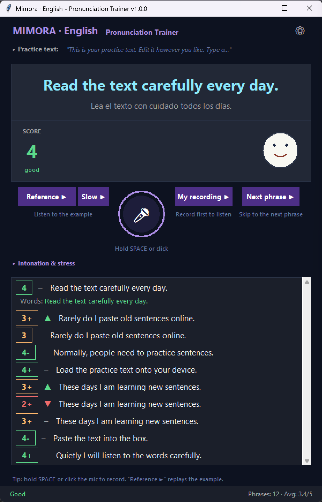
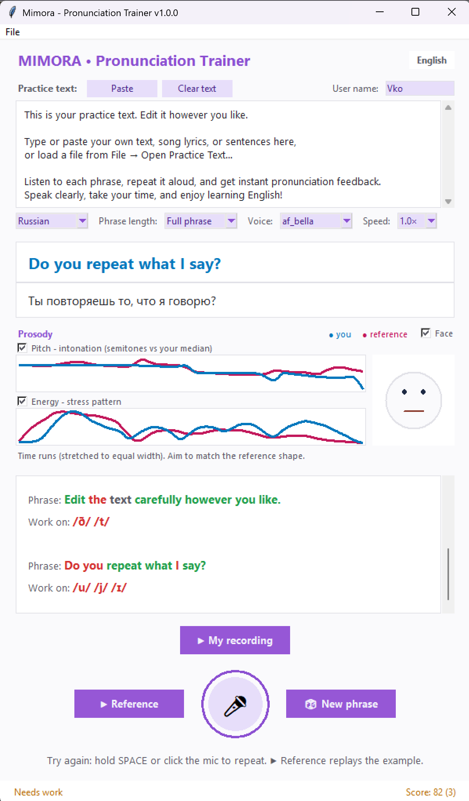

# Mimora

**A local, offline pronunciation trainer.** Mimora says a phrase out loud, you repeat it, and it scores how close you were - highlighting the words to work on. Practice the same phrase until you pass, then move on to the next one. Everything runs on your machine: speech synthesis, speech recognition, phrase generation, and acoustic analysis.

Mimora is built on the SpeakLoop voice-tutor stack. Its default **phoneme** scoring engine is Mimora's own; the alternative **acoustic** engine reuses the pronunciation-scoring core of [OpenPronounce](https://github.com/Halleck45/OpenPronounce) (MIT) as a library.

| Dark theme | Light theme |
|:---:|:---:|
|  |  |

*Themes are configurable in `config/themes/`.*

---

## How it works

For each practice phrase Mimora runs a simple loop:

1. **Prompt** - a phrase is generated by the local LLM from your *practice text*, then spoken aloud by the Kokoro TTS voice (this synthesized audio is also the reference for scoring).
2. **Record** - you press `SPACE` (or click the mic) and repeat the phrase; the take stops on its own once you fall silent (or press `SPACE` / click the mic again).
3. **Analyze** - your recording and the reference are compared in a background thread by the active pronunciation engine - by default the **phoneme** engine (espeak reference phonemes vs a wav2vec2 phoneme recognizer) - plus prosody (pitch / energy). An alternative **acoustic** engine (Wav2Vec2 embeddings + DTW) is selectable via `ENGINE` in `mimora/config.py`.
4. **Feedback** - you get a score out of 100, what was recognized, and the words to improve.
5. **Loop** - repeat the same phrase until the score passes the configurable threshold, then generate the next phrase.

You can replay the **reference** and **your own recording** back-to-back to hear the difference.

---

## Features

- 🎙️ **One-press recording** with peak normalization and automatic silence-based auto-stop.
- 🗣️ **Single voice everywhere** - the reference phrase is synthesized by Kokoro, the same engine used for prompts (no second TTS).
- 🧠 **LLM-generated phrases** built from an editable *practice text* panel - paste your own paragraph, song, or sentences to drill.
- ⚙️ **Practice controls** - pick the Kokoro **voice** and playback **speed**, choose the **phrase length** (full phrase or a few words), and set the **translation language** for the side-by-side translation panel. A **user name** selects the per-user scoring calibration.
- 📊 **Two pronunciation-scoring engines**, selected by `ENGINE` in `mimora/config.py`. The default **phoneme** engine scores espeak reference phonemes against a wav2vec2 phoneme recognizer (feature-weighted edit distance, mapped to a calibrated 0-5 grade). The **acoustic** engine combines per-step cosine DTW over Wav2Vec2 embeddings (40%) with phoneme (30%) and word (30%) error rates. Both are length-invariant and calibratable to your voice (`python pronunciation/<engine>/calibrate.py`).
- 🔁 **Replay reference vs. your recording** to compare.
- 😀 **Articulation face** - a schematic mouth opens and closes with the speech as a reference or your recording plays, and shows a smiley reflecting your score while idle.
- 🧵 **Responsive UI** - analysis and model loading run in daemon threads; the GUI is updated only via `root.after()`.
- 💻 **Fully local & offline** after the models are downloaded.

---

## Architecture

| File | Responsibility |
|---|---|
| `main.py` | `PronunciationTrainerGUI` - Tkinter GUI, recording, the Prompt→Record→Analyze→Feedback→Loop state machine, threading orchestration, LLM-server subprocess management. |
| `mimora/engine.py` | Engine dispatcher - binds the backend chosen by `ENGINE` (`phoneme` default, `acoustic` alternative) and exposes one `analyze(...)` interface, so `main.py` is engine-agnostic. |
| `mimora/prosody.py` | Engine-agnostic prosody layer: F0/energy contour extraction (no torch). Computed in `main.py` from the raw user/reference audio so the pitch/energy charts work the same across engines. |
| `mimora/tts.py` | `TTSManager` - Kokoro TTS. `synthesize()` returns the waveform; `play_array()` plays any waveform (reference at 24 kHz, your recording at 16 kHz). `loudness_envelope()` precomputes the per-frame mouth-openness track used by the face. |
| `mimora/face_widget.py` | `FaceWidget` - schematic articulation face (Tk Canvas). Talking mouth driven from a precomputed loudness track while audio plays; smiley reflecting the score when idle. Stdlib `tkinter` only. |
| `mimora/llm.py` | `LLMManager` - OpenAI-compatible client. `generate_phrase()` produces one practice phrase per request. |
| `mimora/llm_server_ctl.py` | `LLMServerController` - starts/stops the local LLM-server subprocess (used by the `local_server` backend). |
| `mimora/recorder.py` | `AudioRecorder` - microphone capture thread, device selection, normalization and WAV dumps; returns the take as one 16 kHz array. |
| `mimora/audio_io.py` | Shared audio-device infrastructure (PortAudio reset, winsound path selection) depended on by both the mic and speaker paths. |
| `mimora/translator.py` | `TranslatorManager` - offline NLLB-200 translation of the practice phrase for the translation panel. |
| `mimora/ui.py` | `TrainerView` - passive Tkinter view (all widgets and copy), composed into the controller; talks to it only via typed callbacks. |
| `mimora/loader.py` | Pure, stateless config-loading helpers (JSON parsing, setting validation, device probe) used by `config.py`. |
| `mimora/prosody_utils.py` | Pure plotting helpers (`to_semitones`, `resample_series`) kept free of the ML/audio stack. |
| `mimora/config.py` | All configuration: device, model names, score threshold, practice-text path, phrase-generation settings, audio settings. |
| `llm_server/server.py` | Standalone FastAPI server loading GGUF models via `llama_cpp`; runs as a separate process to avoid CUDA contention. See [`llm_server/README.md`](llm_server/README.md). |
| `pronunciation/phoneme/speech.py` | **Default** pronunciation engine - espeak reference phonemes vs a wav2vec2 phoneme recognizer, feature-weighted edit distance, calibrated 0-5 grade. No GUI dependency. |
| `pronunciation/phoneme/calibrate.py` | On-request scoring calibration for the **default** phoneme engine: reads the per-attempt samples from `logs/phoneme_samples.jsonl` and writes `pronunciation/phoneme/calibration.json`. |
| `pronunciation/acoustic/speech.py` | Alternative pronunciation engine (adapted from OpenPronounce). Single entry point `analyze(...)`; Wav2Vec2 embeddings + DTW, phoneme comparison, scoring. No GUI dependency. |
| `pronunciation/acoustic/calibrate.py` | On-request scoring calibration for the acoustic engine: reads the per-attempt samples from `logs/acoustic_samples.jsonl` and writes the acoustic floor to `pronunciation/acoustic/calibration.json`. |
| `config/` | User configuration data: `settings.json` (hand-edited preferences), `hardware_config.json` (machine-derived overrides written by `tools/detect_hardware.py`), and `themes/` (UI color schemes). |
| `texts/practice_text.txt` | Default source text shown in the input panel at startup; put your own practice texts in `texts/`. |
| `tools/detect_hardware.py` | Standalone hardware probe (RAM/CPU/GPU/VRAM/audio). Writes `config/hardware_config.json`, whose `config` section supplies machine-derived overrides (e.g. `EXTERNAL_N_GPU_LAYERS`, `WAV2VEC2_DEVICE`) that `mimora/config.py` reads in preference to its defaults. |
| `install.py` | Standalone, idempotent installer: checks Python, detects GPU/CUDA and installs matching torch / llama-cpp-python, installs requirements, checks espeak-ng, pre-downloads the HF models and the GGUF chat model, then runs `detect_hardware.py`. |

---

## Requirements

- **Python 3.11 or 3.12** (developed and tested on 3.11 and 3.12). Python 3.13 and newer are not yet supported (as of June 2026).
- **Windows** is the primary target (TTS playback uses `winsound`); a `sounddevice` fallback exists for other platforms.
- A microphone and speakers.
- For GPU acceleration: an NVIDIA GPU with a CUDA-enabled PyTorch build.
- **espeak-ng** (native binary, required by the phonemizer) - installed separately, see below.

### Models

`install.py` pre-downloads all of these (see [Quick install](#quick-install-script)).
Otherwise the four Hugging Face models are fetched automatically on first run,
and only the GGUF chat model must be obtained manually.

| Model | Used by | Notes |
|---|---|---|
| `facebook/wav2vec2-xlsr-53-espeak-cv-ft` | pronunciation analysis (**phoneme** engine, default) | espeak IPA phoneme recognizer, ~1.2 GB; via `install.py` or on first run |
| `facebook/wav2vec2-large-960h` | pronunciation analysis (**acoustic** engine) | ~1.2 GB; via `install.py` or on first run |
| Kokoro-82M (`hexgrad/Kokoro-82M`) | text-to-speech | via `install.py` or on first run |
| `facebook/nllb-200-distilled-600M` | offline translation (translation panel) | NLLB-200 200-language translator, ~2.4 GB; via `install.py` or on first run |
| A GGUF chat model (e.g. `Llama-3.2-3B-Instruct-Q4_K_M`) | phrase generation | via `install.py`, or **download manually** into `models/` |

---

## Installation

**`install.py` is the recommended way to install** - it handles dependencies, GPU
builds, and model downloads in one guided run. The manual steps further below are
an alternative if you prefer to run each command yourself.

### Quick install (script, recommended)

`install.py` automates the whole setup: it installs the Python dependencies,
auto-detects an NVIDIA GPU and installs the matching CUDA builds of `torch` and
`llama-cpp-python`, checks for `espeak-ng`, pre-downloads the Hugging Face models
into `model_cache/`, and downloads the GGUF chat model into `models/`.

```bash
git clone <your-repo-url> Mimora
cd Mimora

# Create and activate a virtual environment, then run the installer INSIDE it
# (the script installs into whatever interpreter runs it):
python -m venv .venv
.venv\Scripts\activate            # Windows
# source .venv/bin/activate       # macOS / Linux

python install.py
```

The installer prints each step and the exact command, then asks before running
it (answer `Y` to run, `n` to abort, `s` to skip). Anything already installed is
detected and offered as reinstall-or-skip rather than blindly redone. The full
run is logged to `logs/install.log`.

Expect the full run to take **several minutes** (mostly downloads, so it depends
on your internet speed), and to use roughly **10 GB** of disk once all packages
and models are in place.

Useful flags:

- `--yes` - run non-interactively (skips already-installed steps; add `--reinstall` to force them)
- `--dry-run` - print the steps and commands without executing anything
- `--cpu` - skip the GPU (CUDA) installs
- `--skip-models` / `--skip-gguf` - skip the model / GGUF downloads

`espeak-ng` (a native binary, see below) is checked but not installed on Windows -
follow the printed instructions if it is missing. On Windows, enabling
**Developer Mode** lets the model cache use symlinks; without it the installer
falls back to copying files (more disk use, but it always works).

### Manual installation (alternative)

```bash
# 1. Clone
git clone <your-repo-url> Mimora
cd Mimora

# 2. All dependencies in one step
#    The root requirements.txt already pulls in the subproject files via -r:
#    llm_server/, pronunciation/acoustic/ and pronunciation/phoneme/ (panphon for
#    the default phoneme engine). No separate per-engine install is needed.
pip install -r requirements.txt
```

The offline translator (NLLB-200) needs no extra step - its dependencies
(`transformers`, `sentencepiece`) are already in the root `requirements.txt`.

### Install espeak-ng (required for phoneme analysis)

`phonemizer` needs the native **espeak-ng** binary on your `PATH`:

- **Windows** - download and run the installer from the [espeak-ng releases](https://github.com/espeak-ng/espeak-ng/releases).
- **macOS** - `brew install espeak-ng`
- **Linux** - `sudo apt-get install espeak-ng`

### GPU support (recommended)

The default `torch` and `llama-cpp-python` wheels are CPU-only. For NVIDIA GPUs:

- **PyTorch** - install a CUDA build (other CUDA versions: see [pytorch.org](https://pytorch.org/get-started/locally/)):
  ```powershell
  python -m pip install torch torchaudio --index-url https://download.pytorch.org/whl/cu124 --force-reinstall
  ```
  Reinstall `torch` and `torchaudio` **together**: force-reinstalling `torch` alone
  leaves a `torchaudio` built against the previous torch, which then fails to
  import (`OSError: [WinError 127]`) and breaks pronunciation analysis.
- **llama-cpp-python** - build with CUDA (see [`llm_server/README.md`](llm_server/README.md) for details):
  ```powershell
  $env:CMAKE_ARGS="-DGGML_CUDA=on"
  pip install llama-cpp-python --force-reinstall --upgrade --no-cache-dir
  ```

### Get a GGUF model

`install.py` already downloads `llama-3.2-3b-instruct-q4_k_m.gguf` into `models/`.
To do it manually instead, download a small instruct model (e.g. `Llama-3.2-3B-Instruct-Q4_K_M.gguf`) and place it at the path set by `EXTERNAL_MODEL_PATH` in `mimora/config.py` (default: `models/llama-3.2-3b-instruct-q4_k_m.gguf`).

---

## Usage

```bash
python main.py
```

On first launch the app loads the TTS and pronunciation (Wav2Vec2) models and starts the LLM server. If you ran `install.py` (or already launched once), the models are cached and this is just a load that takes a moment; if any model is still missing, it is downloaded first (several GB), which takes a while. Once it shows **Ready**:

1. Edit the **Practice text** panel (or keep the default).
2. Click **🎲 New phrase** - Mimora generates a phrase and speaks it.
3. **Press `SPACE`** (or click the mic button) and repeat the phrase; the take auto-stops on silence (press `SPACE` / click the mic again to stop manually).
4. Read your **score** and the words to improve in the feedback panel.
5. Use **▶ Reference** / **▶ My recording** to compare, then repeat or generate the next phrase.

The **first few phrases run noticeably slowly** - the models are still warming up
and loading their data into memory on their first call. This is normal; speed
settles to its steady state after the initial requests.

Press `ESC` or close the window to quit (the LLM server subprocess is terminated cleanly).

---

## Configuration

Key options in [`mimora/config.py`](mimora/config.py) (overridable via [`config/settings.json`](config/settings.json)):

| Setting | Default | Description |
|---|---|---|
| `ENGINE` | `phoneme` | Active scoring engine: `phoneme` (**default**) or `acoustic`. Code-only, set in `mimora/config.py`. |
| `WAV2VEC2_PHONEME_MODEL_NAME` | `facebook/wav2vec2-xlsr-53-espeak-cv-ft` | Phoneme-ASR model for the **default** `phoneme` engine (emits espeak-style IPA). |
| `WAV2VEC2_MODEL_NAME` | `facebook/wav2vec2-large-960h` | Embedding/transcription model used only by the `acoustic` engine. |
| `WAV2VEC2_DEVICE` | `DEVICE` (cuda/cpu) | Device for the active engine's Wav2Vec2 model. Set to `"cpu"` to avoid VRAM contention with llama_cpp / Kokoro. |
| `PRONUNCIATION_SCORE_THRESHOLD` | `70.0` | Score (0-100) required to pass a phrase. |
| `PRACTICE_TEXT_FILE` | `texts/practice_text.txt` | Source text pre-loaded into the input panel. |
| `PHRASE_GEN_TEMPERATURE` / `PHRASE_GEN_MAX_TOKENS` | `0.7` / `40` | Phrase-generation sampling. |
| `PHRASE_GEN_WINDOW_SENTENCES` | `5` | Sentences of the source text sent to the model per request (sliding window). |
| `PHRASE_GEN_WINDOW_REPEATS` | `5` | Phrases generated per window position before it slides forward by half its size. |
| `LLM_BACKEND` | `local_server` | `local_server` (auto-started subprocess) or `lm-studio`. |
| `MAX_RECORD_SECONDS` | `20` | Safety cap on recording length. |

---

## Using the pronunciation core as a library

Both engine packages are GUI-agnostic and can be used on their own. The example below uses the **default** `phoneme` engine; the `acoustic` package exposes the same `load_models()` / `analyze(...)` interface:

```python
from pronunciation import phoneme   # default engine; or: from pronunciation import acoustic

phoneme.load_models()   # load Wav2Vec2 once (and warm_up() to remove first-call latency)

result = phoneme.analyze(
    user_audio=user_waveform,        # np.ndarray, 16 kHz mono
    expected_text="hello world",
    reference_audio=reference_wav,   # np.ndarray (e.g. Kokoro output)
    user_sr=16000,
    reference_sr=24000,
)

print(result.score)              # 0-100
print(result.passed)             # score >= threshold
print(result.transcription)      # what was recognized
print(result.words_with_errors)  # words to improve
# result.prosody is {} from the engine: pitch/energy contours are the
# engine-agnostic audio layer (mimora/prosody.py), filled in by the host.
```

### Running the tests

```bash
# Fast unit tests for every module, both engines (pure logic, no model download, offline)
python -m unittest discover -s tests -v

# Optional end-to-end check on real audio (downloads the model, needs espeak-ng).
# tests/test_speech.py exercises the acoustic engine:
python tests/test_speech.py path/to/user.wav [path/to/reference.wav]
```

---

## GPU / CPU notes

Several torch models (the active engine's Wav2Vec2 - the `phoneme` recognizer by default, Kokoro, and the NLLB translator) plus `llama_cpp` can compete for VRAM on a single GPU. Mimora mitigates this two ways:

- The LLM runs in a **separate process** (`llm_server/`), and the practice loop runs its phases (LLM → Kokoro → Wav2Vec2) **sequentially**, so they don't synthesize/infer at the same time. The NLLB translator defaults to CPU (`TRANSLATOR_DEVICE`).
- If VRAM is still tight, set `WAV2VEC2_DEVICE = "cpu"` in `mimora/config.py` - short phrases analyze acceptably on CPU.

---

## Known limitations

- **Practice language is English for now.** The `acoustic` engine is English-only (English ASR model + phonemizer `en-us`). The default `phoneme` engine uses a multilingual IPA recognizer and is planned to be calibrated for other languages in future releases. (The translation panel already targets many languages - that is the practice phrase's translation, not the practice language itself.)
- The transcription-based word errors only surface mistakes the ASR actually "hears"; subtle distortions where the word is still recognized may not appear in the word list (the default phoneme engine's IPA edit distance, or the acoustic engine's DTW, plus prosody partially compensate).
- Scoring is **heuristic** and depends on your voice and microphone. After a practice session, re-anchor the active engine to your data: `python pronunciation/phoneme/calibrate.py` (default engine) or `python pronunciation/acoustic/calibrate.py` (acoustic engine); `--dry-run` previews the change. Every attempt's raw components are logged to `logs/phoneme_samples.jsonl` (or `logs/acoustic_samples.jsonl`) and `logs/main.log` for inspection.

---

## Credits

- **[OpenPronounce](https://github.com/Halleck45/OpenPronounce)** (MIT) - the pronunciation-scoring core reused in `pronunciation/acoustic/`.
- **[Kokoro-82M](https://huggingface.co/hexgrad/Kokoro-82M)** - text-to-speech.
- **[wav2vec2-xlsr-53-espeak-cv-ft](https://huggingface.co/facebook/wav2vec2-xlsr-53-espeak-cv-ft)** (Hugging Face Transformers) - espeak-style IPA phoneme recognizer for the default `phoneme` engine.
- **[Wav2Vec2](https://huggingface.co/facebook/wav2vec2-large-960h)** (Hugging Face Transformers) - acoustic embeddings and transcription (`acoustic` engine).
- **[NLLB-200](https://huggingface.co/facebook/nllb-200-distilled-600M)** (Hugging Face Transformers) - offline translation for the translation panel.
- **[espeak-ng](https://github.com/espeak-ng/espeak-ng)** / **[phonemizer-fork](https://github.com/bootphon/phonemizer)** - reference phonemization (espeak IPA).
- **[panphon](https://github.com/dmort27/panphon)** - articulatory feature distance used by the phoneme edit-distance scoring.
- **[llama.cpp](https://github.com/ggerganov/llama.cpp)** / **[llama-cpp-python](https://github.com/abetlen/llama-cpp-python)** - local LLM inference.

## License

See [`LICENSE`](LICENSE). The reused OpenPronounce components are MIT-licensed; their attribution is retained in `pronunciation/acoustic/speech.py`.
